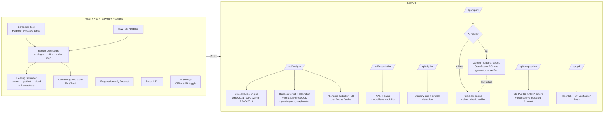

# 🎧 AudioSense AI

**AI-powered Pure Tone Audiometry interpretation platform** — clinically rigorous, offline-first, built to demo.

Enter (or photograph!) an audiogram → get WHO-2021 grading, conductive/sensorineural typing, India RPwD Act 2016 disability percentage, an ML pattern classification with calibrated confidence + out-of-distribution flagging, a phoneme-level functional impact map, a verified clinical report with a Tamil+English patient counseling sheet — and then **hear the world through the patient's ears** with the Web Audio hearing loss simulator.

## 🎯 Against the problem statement

The brief asks for automatic analysis, pattern classification, degree and type prediction, disability estimation and an AI-generated report — because interpretation is *time-consuming*, *expertise-dependent*, and delays diagnosis in *high-volume settings*. All five features are built; these are the numbers behind the justification:

| Claim in the brief | What this system does | Measured |
|---|---|---|
| "time-consuming" | Full interpretation per audiogram | **~670 ms**, 89 cases/minute on a laptop |
| "high-patient-volume" | Triage worklist ordered by clinical priority, not upload order | 8-case batch → 2 flagged for review, **75% of drafts auto-releasable** |
| "dependent on audiologist availability" | Explicit auto-release vs review routing, with reasons | Conservative by design: anything atypical, provisional or entitlement-bearing routes to a human |
| "more consistent" | Guideline conformance swept across the entire input space + reproducibility proof | 261 WHO grade checks, 323 AC/BC type combinations, 625 disability combinations, 50× identical-output runs |
| Accuracy | Validation harness against expert-labelled audiograms | Rules **100% (κ=1.0)**; ML pattern **83.3% (κ=0.795, "substantial")** on the bundled labelled set |

**On the 99.9% figure.** That is hold-out accuracy on synthetic data and means only that the model learned its own generator — it is not clinical accuracy and this README will not present it as such. The number worth quoting comes from `/api/validate` run on real expert-labelled audiograms; `samples/validation_labelled.csv` shows the format. Degree, type and disability are deterministic implementations of published guidelines, so they are validated by conformance rather than by statistics — hence κ=1.0 and a 0.00% disability error.

## ✨ Signature features

| | |
|---|---|
| 🚦 **Triage worklist** | A batch comes back ordered by who needs a clinician first, each case carrying an explicit *review required* or *auto-releasable* decision with its reasons — the actual bottleneck in a high-volume clinic |
| 📷 **Bulk paper ingestion** | Drop a folder of photographed audiograms and get a triaged worklist; the department's paper backlog becomes a queue |
| 🔬 **Cross-modal test battery** | Tympanometry, acoustic reflexes and otoacoustic emissions reconciled against the audiogram — the engine reports whether the tests **agree**, and names the pattern when they don't (effusion confirmed, otosclerosis, auditory neuropathy, non-organic) |
| ⏳ **Damage before the audiogram moves** | Absent emissions with normal thresholds = **pre-clinical cochlear damage**. This is the difference between screening for injury already done and injury still preventable |
| 📐 **Bayesian screening** | A QUEST/ZEST posterior over threshold: every result carries a **95% credible interval**, plus silent catch trials that flag a patient responding to nothing |
| 🎤 **Live conversation mode** | Speak, and your own sentence appears struck through where this patient loses it — powered by the same word-audibility engine as the report |
| 🎧 **True binaural simulation** | Each ear processed with its own audiogram in stereo, with head shadow — asymmetric loss is heard as *lateralised*, not just quieter |
| 🚨 **Red-flag referral engine** | Detects **sudden SNHL** (steroids are time-critical) and **asymmetric loss** (MRI to exclude vestibular schwannoma), and refuses to bury them — emergencies sort above everything else on the page |
| 🔍 **Test-validity checks** | Flags when **masking was indicated but not done** (a shadow curve from the opposite ear), and when the **SRT disagrees with the pure tones** — the classic sign of non-organic hearing loss |
| 🗣 **Speech audiometry** | SRT/PTA agreement, word-recognition banding, and the **rollover index** for retrocochlear screening |
| 🔊 **Hearing Loss Simulator** | The audiogram becomes a live BiquadFilter cascade — a three-way toggle between **normal hearing → this patient → with a hearing aid** on bundled speech, uploaded audio, or the **live microphone** |
| 🍽 **Restaurant noise + everyday sounds** | An SNR slider adds competing babble with the SII moving live, and synthesized real-world sounds (smoke alarm, birdsong, reversing truck, doorbell, phone) show what else disappears |
| 💸 **Prescription vs cheap amplifier** | Hear NAL-R shaped gain against the flat roadside amplifier that just makes everything louder — the argument for proper fitting, audible |
| 🦻 **Hearing-aid preview** | A NAL-R prescription (Byrne & Dillon 1986) plus output compression, applied in real time — judges *hear* the intervention work, not just the deficit |
| 💬 **Live speech captions** | The test sentence is shown with the words this patient would mishear **struck through**, restored the moment the aid is switched on |
| 🎧 **In-browser screening** | A calibrated-anchor, modified Hughson-Westlake staircase (down 10 / up 5) that measures your own audiogram in ~90 seconds and feeds it into the full pipeline |
| 📷 **Snap-to-Digitize** | Photo of a paper audiogram → OpenCV grid + symbol detection (red O/[ , blue X/]) → editable thresholds with per-value confidence (human-in-the-loop) |
| 🍌 **Phoneme map + SII** | The speech banana on the audiogram, plus a band-importance-weighted **Speech Intelligibility Index** in quiet, in noise, and aided |
| 🐚 **Cochlear damage map** | Greenwood frequency-place mapping shows *where on the basilar membrane* the loss sits — the 4 kHz notch as a glowing lesion at the basal turn |
| 📈 **5-year forecast** | Projects continued exposure vs effective hearing protection, with an uncertainty band and preventable-loss figure in dB |
| 🧠 **ML pattern classifier** | RandomForest, calibrated probabilities, 7 clinical configurations, per-frequency explanation glow on the chart, IsolationForest OOD → "atypical — priority human review" |
| 🤔 **Counterfactuals + case retrieval** | "If 4 kHz were 10 dB better, this would classify as flat" — plus the 12 nearest reference audiograms and how many agree |
| ✍️ **Clinician correction loop** | Disagree with the AI and the override is logged with its thresholds for the next training run — human-in-the-loop MLOps, not a black box |
| ✅ **Verified reports** | Dual-engine pipeline (offline template engine or any LLM provider) with a verifier pass that re-checks every number — "verified ✓" is earned, not decorative |
| 🌏 **Six languages + QR handout** | Counseling in English, Tamil, Hindi, Telugu, Kannada and Malayalam — read aloud, or scanned as a QR that opens the sheet on the patient's own phone |
| 📊 **Camp dashboard** | Batch a whole factory shift and get prevalence by age band, noise-notch rate and benchmark-disability counts — "27% of this cohort shows early NIHL" |
| 📴 **Installable PWA** | Service-worker cached app shell and audio, so entry, simulation and screening keep working in a village camp with no connectivity |
| 🗂 **Longitudinal records** | SQLite patient history with multi-visit trend lines, so hearing conservation stops being a two-point comparison |
| 📮 **One-click ENT referral** | A referral letter carrying the exact red-flag criteria met, the audiogram findings and the battery result |
| 📢 **Noise-dose calculator** | OSHA and NIOSH dose from real task exposures, with NRR derating — grounding the forecast in exposure rather than trend alone |
| 🗺 **Population atlas** | PCA projection of all 12,000 training audiograms with the patient plotted, making the out-of-distribution flag visual |
| 🔌 **Offline ↔ API toggle** | Fully functional with **zero API keys**. Optional providers: Gemini (free tier), Anthropic, Groq, OpenRouter, Ollama — with automatic fallback to offline if a call fails |

## 🏗 Architecture



## 🚀 Run it (Windows-friendly)

Prereqs: Python 3.11+, Node 18+.

**1. Backend** (first run: ~2 min for deps + ~1 min training)

```bash
cd backend
python -m venv .venv
.venv\Scripts\pip install -r requirements.txt
.venv\Scripts\python -m app.ml.generate_dataset
.venv\Scripts\python -m app.ml.train
.venv\Scripts\python -m uvicorn app.main:app --port 8000
```

**2. Frontend** (second terminal)

```bash
cd frontend
npm install
npm run dev
```

Open **http://localhost:5173**. No API key needed — everything works offline. To enable LLM narratives, click the **AI Engine** panel (bottom-left gear) and paste a free Gemini key from [aistudio.google.com](https://aistudio.google.com).

**Tests** (240 tests: guideline conformance swept across the whole input space, reproducibility, red-flag and masking logic, speech audiometry, triage routing, validation metrics, progression, phonemes, SII, NAL-R prescription, forecast, counterfactuals, camp statistics, six-language counseling, digitizer-vs-ground-truth, full API cycle):

```bash
cd backend
.venv\Scripts\python -m pytest -q
```

Training artifacts land in `backend/data/`: `confusion_matrix.png` + `accuracy_report.txt` (99.9% hold-out accuracy on 12,000 synthetic audiograms).

## 🎬 3-minute demo script

**0:00 — The hook.** "One in five people has hearing loss; audiologists are scarce. AudioSense turns any audiometer printout into a full clinical interpretation." Open **New Test**.

**0:10 — The one nobody else catches.** Load **🔬 Pre-clinical Noise Damage**. The audiogram is *completely normal* — every threshold within limits. Then the battery panel: emissions are absent at 4 and 8 kHz. "This 26-year-old welder's cochlea is already dying, and every conventional screening in the country would send him back to the shipyard. We can still save this hearing."

**0:25 — The save.** Load the **🚨 Sudden Asymmetric Loss** demo case. The dashboard opens with a pulsing red banner: *possible sudden sensorineural hearing loss — steroids are time-critical*, plus an asymmetry flag recommending MRI and a rollover finding suggesting retrocochlear pathology. Say it plainly: "most audiogram tools would have called this 'moderate sensorineural loss' and booked a hearing-aid fitting."

**0:35 — Snap-to-Digitize.** Drag `samples/audiogram_photo_1.png` onto the drop zone. Watch the paper chart become editable thresholds with confidence badges — point out the *human-in-the-loop* banner (OpenCV, fully offline). Click **Analyze →**.

**1:00 — Dashboard.** The audiogram renders with correct clinical notation; the **teal glow at 4 kHz** shows what drove the AI's "Noise notch" call. Open **Why this classification?** — *"if 4 kHz were 10 dB better, this would classify as flat"*, and 12 of 12 nearest reference cases agree. Walk the cards: WHO degree, type via air-bone gap, **RPwD disability % with the full formula expanded**, the cochlea map showing the lesion at the basal turn. Report carries the **verified ✓** badge.

**1:40 — Toggle Phonemes.** The speech banana appears; /s/, /f/, /th/ glow red — "he'll miss plurals and children's voices."

**1:55 — The showstopper.** Click **🎧 Hear as this patient**. Play on *Normal*, flip to *This Patient* — the 4 kHz world vanishes and captions strike out the words he loses. Hit **With Hearing Aid**: struck words return, SII goes 65% → 78%. Then switch the aid to **Cheap amplifier** — everything gets louder, clarity doesn't come back. Turn on **Restaurant noise** and drag the SNR slider to 0 dB: this is the complaint every patient actually has. Finally tap **🚨 Smoke alarm** — for this patient, it is gone.

**2:25 — Prevention.** Progression page: OSHA STS flagged after 3 years of noise exposure; the 5-year projection shows *Moderate if exposure continues* vs *Mild with protection* — **15.6 dB of preventable hearing**, disability rising 6% → 33%.

**2:40 — Scale + reach.** Batch page: 8-patient CSV clears in **5 seconds — 89 audiograms a minute** — and comes back as a *worklist*: two flagged for an audiologist, six drafts auto-releasable. Then **🔬 Validate vs expert labels**: rules 100% (κ=1.0), ML pattern 83.3% (κ=0.795) — "we quote the number measured against experts, not the one measured against our own generator." Camp view adds *"38% of this cohort shows a 4 kHz noise notch"*. Counseling in six languages, read aloud, or handed over as a **QR the patient scans onto their own phone**. The **Screening Test** page measures a judge's own hearing live into the same pipeline. Installable and offline-capable; add any LLM key for narrative reports, with automatic fallback so the demo can't die.

**2:55 — Close.** "Deterministic clinical core, calibrated ML with an honesty flag, and empathy you can hear. AudioSense AI."

## 📁 Repo map

```
backend/
  app/clinical/    rules.py (WHO/ABG/RPwD, cited docstrings) · progression.py (OSHA/ASHA)
                   safety.py (red flags + masking validity) · speech_audiometry.py (SRT/WRS/rollover)
                   triage.py (priority + auto-release routing)
                   immittance.py (tympanograms + reflexes) · oae.py (emissions)
                   consistency.py (cross-modal reconciliation) · noise_dose.py (OSHA/NIOSH)
                   prescription.py (NAL-R + aided verification) · forecast.py (5-year projection)
  app/ml/          generate_dataset.py · features.py · train.py
                   classifier.py (calibration · OOD · counterfactuals · case retrieval)
  app/services/    phonemes.py · sii.py (SII + word audibility) · vision.py (OpenCV)
                   report.py (template+LLM, verifier) · languages.py (6 languages)
                   records.py (SQLite visits) · referral.py (ENT letter)
                   validation.py (expert-label agreement, Cohen's kappa)
                   llm_provider.py (5 providers) · ai_config.py · pdf.py (QR hash)
  app/routers/     analyze · prescription · speech-words · digitize · report · progression
                   batch · pdf · settings · feedback · handout (QR) · clinic (records,
                   noise-dose, referral, atlas)
  tests/           179 pytest tests incl. boundary values (PTA 20/35/50, ABG 10)
  scripts/         make_samples.py (regenerates the demo photos + ground truth)
samples/           2 audiogram photos + ground_truth.json + batch_sample.csv
frontend/
  src/pages/       NewTest · Screening · Dashboard · Simulator · Progression · Batch · Records
  src/components/  AudiogramChart (clinical symbols, glow, banana) · CochleaMap (Greenwood)
                   ThresholdGrid · AISettingsPanel
  src/audio/       simulatorGraph.js (loss + aid + compression + babble + binaural)
                   soundscapes.js (synthesized everyday sounds) · toneAudiometer.js
                   bayesianThreshold.js (QUEST/ZEST + catch trials)
  src/lib/         api.js · store.jsx · speech.js (6-language TTS) · conversation.js
                   svgCapture.js
  public/          audio/speech_sample.wav · sw.js (offline) · manifest.webmanifest
```

## ⚕️ Clinical grounding

- **PTA & degree**: 4-frequency average (500/1k/2k/4k), WHO World Report on Hearing (2021) grades.
- **Type**: air-bone gap > 10 dB significant; Conductive/Sensorineural/Mixed per standard audiological criteria; missing BC → *"type provisional — BC not tested."*
- **Disability**: India RPwD Act 2016 / 2018 Gazette formula — monaural 1.5×(PTA−25), binaural (5×better+worse)/6, benchmark ≥ 40%.
- **Progression**: OSHA 29 CFR 1910.95 standard threshold shift (2k/4k proxy, documented); ASHA (1994) ototoxicity criteria.
- **Red flags**: sudden SNHL = ≥30 dB across ≥3 contiguous frequencies within 72 h (confirmed against a prior audiogram where one exists, otherwise conditional on reported onset); asymmetry referral at ≥20 dB at one frequency or ≥15 dB at two.
- **Masking**: interaural attenuation of 40 dB for supra-aural earphones (AC) and ~0 dB for BC; a warning is raised only when masking was indicated *and* not recorded.
- **Speech audiometry**: SRT/PTA agreement within ±10 dB; rollover index > 0.45 as the retrocochlear indicator.
- **Immittance**: Jerger tympanogram types (A/As/Ad/B/C), Type B split by ear-canal volume (effusion vs perforation); acoustic reflexes normally 70–100 dB SL.
- **OAE**: DPOAE counted present at ≥6 dB above the noise floor; absent emissions with normal thresholds reported as pre-clinical outer-hair-cell damage.
- **Bayesian screening**: QUEST/ZEST posterior with a logistic psychometric function (4.5 dB slope, 2% guess, 3% lapse), stopping on a 10 dB credible interval. Benchmarked against the staircase over 300 simulated listeners — 9.6 vs 11.6 presentations, 2.7 vs 3.3 dB mean absolute error, and 1.3% vs 0.3% of thresholds off by more than 10 dB. The gain is calibrated uncertainty, not raw speed.
- **Noise dose**: OSHA 29 CFR 1910.95 (90 dBA, 5 dB exchange) and NIOSH 1998 (85 dBA, 3 dB exchange); protector attenuation derated as (NRR − 7) / 2.
- **Prescription**: NAL-R insertion gain (Byrne & Dillon 1986); bands already within normal limits receive no gain. Aided verification tolerances ±10 dB against target.
- **SII**: band-importance-weighted audibility simplified from ANSI S3.5-1997; reported as *share of speech cues audible*, never as a predicted word score.
- **Screening**: modified Hughson-Westlake (ASHA 2005) with ISO 389-1 RETSPL frequency corrections and a user calibration anchor — labelled a screening, not a diagnostic audiogram.
- **Forecast**: linear extrapolation vs an ISO 7029-style age-only scenario, shown with an uncertainty band and an explicit "not a validated prognosis" caveat.
- **"No Response"** computes as 120 dB HL and is flagged in every result it touches.

Every one of these is presented with its limits stated in the UI, because a hackathon
demo that overclaims on a medical number is worse than one that admits what it can't know.

> AI-assisted interpretation; final diagnosis requires a qualified audiologist.
