# 🎧 AudioSense AI

**AI-powered Pure Tone Audiometry interpretation platform** — clinically rigorous, offline-first, built to demo.

Enter (or photograph!) an audiogram → get WHO-2021 grading, conductive/sensorineural typing, India RPwD Act 2016 disability percentage, an ML pattern classification with calibrated confidence + out-of-distribution flagging, a phoneme-level functional impact map, a verified clinical report with a Tamil+English patient counseling sheet — and then **hear the world through the patient's ears** with the Web Audio hearing loss simulator.

📖 **[WALKTHROUGH.md](WALKTHROUGH.md)** — complete explanation of every part of the project
🚀 **[DEPLOYMENT.md](DEPLOYMENT.md)** — deploy to Vercel + any Docker host (local development is unaffected)
🎤 **[PITCH.md](PITCH.md)** — the jury presentation, with a timed 3-minute demo running order

## 🎯 Against the problem statement

The brief asks for automatic analysis, pattern classification, degree and type prediction, disability estimation and an AI-generated report — because interpretation is *time-consuming*, *expertise-dependent*, and delays diagnosis in *high-volume settings*. All five features are built; these are the numbers behind the justification:

| Claim in the brief | What this system does | Measured |
|---|---|---|
| "time-consuming" | Full interpretation per audiogram | **~670 ms**, 89 cases/minute on a laptop |
| "high-patient-volume" | Triage worklist ordered by clinical priority, not upload order | 8-case batch → 2 flagged for review, **75% of drafts auto-releasable** |
| "dependent on audiologist availability" | Explicit auto-release vs review routing, with reasons | Conservative by design: anything atypical, provisional or entitlement-bearing routes to a human |
| "more consistent" | Guideline conformance swept across the entire input space + reproducibility proof | 261 WHO grade checks, 323 AC/BC type combinations, 625 disability combinations, 50× identical-output runs |
| Accuracy | Validation harness against expert-labelled audiograms | Rules **100% (κ=1.0)**; ML pattern **83.3% (κ=0.795, "substantial")** on the bundled labelled set |

**On the 99.9% figure.** That is hold-out accuracy on synthetic data and means only that the model learned its own generator — it is not clinical accuracy and this README will not present it as such. The number worth quoting comes from `/api/validate` run on real expert-labelled audiograms; `samples/validation_labelled.csv` shows the format. Degree, type and disability are deterministic implementations of published guidelines, so they are validated by conformance rather than by statistics — hence κ=1.0 and a 0.00% disability error.

## ✨ Signature features

| | |
|---|---|
| 🔗 **Everything cross-checks everything** | Four links, live on every screen: the **image against the history** (an otitis media picture and a patient reporting pain and fever confirm each other; a normal drum with fever does not), the **image against the audiogram**, the **history against type, degree, symmetry and PTA**, and the **tympanogram against the disease list**. Conflicts always sort above agreements, because two tests that cannot both be true is the finding — a page of green ticks that buries it is worse than no panel at all |
| 🩺 **Signs & symptoms triage** | "Water keeps coming out of my ear." Free text or checklist → ranked differential, **red flags that outrank it**, and the test battery that separates the possibilities — from two clinical reference documents, matched deterministically with no network call. Age changes the answer: the same discharge is acute otitis media in a child and **necrotizing otitis externa** in a diabetic of seventy-five |
| 👁 **Otoscopy pattern matching** | A tympanic-membrane photo against a **62-view labelled atlas** across eight patterns, returning a ranked differential, the three closest reference images side by side, and the measurements behind the call. Then the part that does not depend on the classifier: what the appearance *predicts* — a large canal volume, a Type B trace, a 20–45 dB gap — checked against what was actually measured |
| 📉 **Tympanometry, all eight types** | The full classification from the immittance reference — A, As, Ad, **Add**, B, C, **D**, **E** — not the five-type scheme. A notched peak is a scarred drum (D) or a broken ossicular chain (E), which the five-type version files as "deep" and loses. Type B splits **three** ways on canal volume, and the third is the one that matters: small volume is wax or a blocked probe, an artefact otherwise reported as middle-ear disease. Every type ships a **generated curve**, and each curve re-classifies as itself |
| 🔗 **Diseases from any single input** | A ranked differential from the **image alone**, or the **audiogram alone**, with no history required — a scope goes in the ear before the patient is in the booth. The audiogram is matched against a characteristic curve per disease on four separate axes (shape, degree, type, symmetry), all four shown, because a disease can match the shape perfectly and be excluded by the type |
| 🎚 **Masking, decided per frequency** | Both air-conduction rules — AC(TE)−AC(NTE) ≥ IA **and** AC(TE)−BC(NTE) ≥ IA — because the second catches the case the first misses: a conductive loss in the *non-test* ear lowers the bar the crossed signal has to clear. Bone conduction masks at a 15 dB gap, with no interaural attenuation to rely on. The **transducer is a clinical choice, not a logistical one**: supra-aural 40 dB, insert 50–60 dB, and it changes the answer. Where the noise needed exceeds the level at which it crosses back, the app reports a **masking dilemma** rather than a threshold |
| 🗣 **SDT, SRT and WRS with their real uncertainty** | All three speech measurements, cross-checked against each other and the tones. **A word score is a sample, not a measurement**: every score carries its exact binomial confidence interval, so 88% and 76% on a 25-word list are correctly reported as *not different*. SDT must track the best pure-tone threshold and sit 5–10 dB better than the SRT — a detection threshold poorer than reception is impossible and says so. A score taken nearer than 30 dB above the SRT is flagged rather than interpreted, because it measures the presentation level, not the patient |
| 🌀 **DP-gram with a stated protocol** | Emission and noise floor per frequency, pass/refer against newborn, screening, occupational or diagnostic criteria, and the **cochlear place** each dropout maps to. Absent emissions above 50 dB HL are marked *uninformative*, not counted as damage — that would be double-counting the audiogram |
| 🧭 **Spatial hearing test** | HRTF-rendered sound placed around the listener, each ear through its own loss. With normal ears the interaural difference **flips sign** with direction; with asymmetric loss it stays positive whichever side the sound came from — the cue is gone, which is why the patient turns the wrong way. Measured, not asserted |
| 🍽 **Digits-in-noise** | The adaptive digit-triplet test behind national screening programmes. Only the speech-to-noise *ratio* matters, so it works on uncalibrated equipment — and it catches the patient with a clean audiogram who still cannot follow a conversation |
| 🔔 **Tinnitus matching + notched therapy** | Match pitch and loudness, then generate a notched masker that carves a half-octave hole at exactly that pitch while leaving its neighbours intact |
| 🎯 **The answer, first** | The dashboard opens with one plain sentence, the figures that carry the decision, and the single next step — everything below it is the evidence |
| 🧭 **Guided tour** | "Show me around" spotlights each part of the interface and says why it exists, so the software explains itself |
| 📅 **Hearing age (ISO 7029)** | "These ears are performing like a typical 55-year-old's — 29 years older than the patient." One line that does more counseling work than a page of decibels |
| 🚦 **Triage worklist** | A batch comes back ordered by who needs a clinician first, each case carrying an explicit *review required* or *auto-releasable* decision with its reasons — the actual bottleneck in a high-volume clinic |
| 📷 **Bulk paper ingestion** | Drop a folder of photographed audiograms and get a triaged worklist; the department's paper backlog becomes a queue |
| 🔬 **Cross-modal test battery** | Tympanometry, acoustic reflexes and otoacoustic emissions reconciled against the audiogram — the engine reports whether the tests **agree**, and names the pattern when they don't (effusion confirmed, otosclerosis, auditory neuropathy, non-organic) |
| ⏳ **Damage before the audiogram moves** | Absent emissions with normal thresholds = **pre-clinical cochlear damage**. This is the difference between screening for injury already done and injury still preventable |
| 📐 **Bayesian screening** | A QUEST/ZEST posterior over threshold: every result carries a **95% credible interval**, plus silent catch trials that flag a patient responding to nothing |
| 🎤 **Live conversation mode** | Speak, and your own sentence appears struck through where this patient loses it — powered by the same word-audibility engine as the report |
| 🎧 **True binaural simulation** | Each ear processed with its own audiogram in stereo, with head shadow — asymmetric loss is heard as *lateralised*, not just quieter |
| 🚨 **Red-flag referral engine** | Detects **sudden SNHL** (steroids are time-critical) and **asymmetric loss** (MRI to exclude vestibular schwannoma), and refuses to bury them — emergencies sort above everything else on the page |
| 🔍 **Test-validity checks** | Flags when **masking was indicated but not done** (a shadow curve from the opposite ear), and when the **SRT disagrees with the pure tones** — the classic sign of non-organic hearing loss |
| 🗣 **Speech audiometry** | SRT/PTA agreement, word-recognition banding, and the **rollover index** for retrocochlear screening |
| 🔊 **Hearing Loss Simulator** | The audiogram becomes a live BiquadFilter cascade — a three-way toggle between **normal hearing → this patient → with a hearing aid** on bundled speech, uploaded audio, or the **live microphone** |
| 🍽 **Restaurant noise + everyday sounds** | An SNR slider adds competing babble with the SII moving live, and synthesized real-world sounds (smoke alarm, birdsong, reversing truck, doorbell, phone) show what else disappears |
| 💸 **Prescription vs cheap amplifier** | Hear NAL-R shaped gain against the flat roadside amplifier that just makes everything louder — the argument for proper fitting, audible |
| 🦻 **Hearing-aid preview** | A NAL-R prescription (Byrne & Dillon 1986) plus output compression, applied in real time — judges *hear* the intervention work, not just the deficit |
| 💬 **Live speech captions** | The test sentence is shown with the words this patient would mishear **struck through**, restored the moment the aid is switched on |
| 🎧 **In-browser screening** | A calibrated-anchor, modified Hughson-Westlake staircase (down 10 / up 5) that measures your own audiogram in ~90 seconds and feeds it into the full pipeline |
| 📷 **Snap-to-Digitize** | Photo of a paper audiogram → OpenCV grid + symbol detection (red O/[ , blue X/]) → editable thresholds with per-value confidence (human-in-the-loop) |
| 🍌 **Phoneme map + SII** | The speech banana on the audiogram, plus a band-importance-weighted **Speech Intelligibility Index** in quiet, in noise, and aided |
| 🐚 **Cochlear damage map** | Greenwood frequency-place mapping shows *where on the basilar membrane* the loss sits — the 4 kHz notch as a glowing lesion at the basal turn |
| 📈 **5-year forecast** | Projects continued exposure vs effective hearing protection, with an uncertainty band and preventable-loss figure in dB |
| 🧠 **Deep ensemble, honestly benchmarked** | Five networks whose disagreement separates "this is hard" from "I have never seen this". Run head-to-head with the forest: the ensemble is marginally more accurate, the **forest is better calibrated**, and the forest stays primary — the comparison is in the app at `/api/model/comparison` |
| 🧠 **ML pattern classifier** | RandomForest, calibrated probabilities, 7 clinical configurations, per-frequency explanation glow on the chart, IsolationForest OOD → "atypical — priority human review" |
| 🤔 **Counterfactuals + case retrieval** | "If 4 kHz were 10 dB better, this would classify as flat" — plus the 12 nearest reference audiograms and how many agree |
| ✍️ **Clinician correction loop** | Disagree with the AI and the override is logged with its thresholds for the next training run — human-in-the-loop MLOps, not a black box |
| ✅ **Verified reports** | Dual-engine pipeline (offline template engine or any LLM provider) with a verifier pass that re-checks every number — "verified ✓" is earned, not decorative |
| 🌏 **Six languages + QR handout** | Counseling in English, Tamil, Hindi, Telugu, Kannada and Malayalam — read aloud, or scanned as a QR that opens the sheet on the patient's own phone |
| 📊 **Camp dashboard** | Batch a whole factory shift and get prevalence by age band, noise-notch rate and benchmark-disability counts — "27% of this cohort shows early NIHL" |
| 📴 **Installable PWA** | Service-worker cached app shell and audio, so entry, simulation and screening keep working in a village camp with no connectivity |
| 🗂 **Longitudinal records** | SQLite patient history with multi-visit trend lines, so hearing conservation stops being a two-point comparison |
| 📮 **One-click ENT referral** | A referral letter carrying the exact red-flag criteria met, the audiogram findings and the battery result |
| 📢 **Noise-dose calculator** | OSHA and NIOSH dose from real task exposures, with NRR derating — grounding the forecast in exposure rather than trend alone |
| 🗺 **Population atlas** | PCA projection of all 12,000 training audiograms with the patient plotted, making the out-of-distribution flag visual |
| 🔌 **Offline ↔ API toggle** | Fully functional with **zero API keys**. Optional providers: Gemini (free tier), OpenAI, Anthropic, Groq, OpenRouter, Ollama — with automatic fallback to offline if a call fails |

## 🏗 Architecture

```mermaid
flowchart LR
    subgraph Frontend [React + Vite + Tailwind + Recharts]
        SY[Signs & Symptoms<br/>complaint → differential] --> OT
        OT[Otoscopy<br/>image vs reference atlas] --> DB
        SCR[Screening Test<br/>Hughson-Westlake tones] --> DB
        NT[New Test / Digitize] --> DB[Results Dashboard<br/>audiogram · SII · cochlea map]
        IMM[Immittance & OAE<br/>tympanogram curve · DP-gram] --> DB
        DB --> SIM[Hearing Simulator<br/>normal → patient → aided<br/>+ live captions]
        DB --> TTS[Counseling read aloud<br/>EN / Tamil]
        PROG[Progression + 5y forecast] & BATCH[Batch CSV]
        SET[AI Settings<br/>Offline / API toggle]
    end

    subgraph Backend [FastAPI]
        SYM[/api/symptoms/] --> KB[Complaint guide by age band<br/>+ 14-disease reference<br/>+ red-flag rules]
        OTO[/api/otoscopy/] --> OTOM[Illumination-normalised features<br/>+ PCA/logistic over 8 patterns<br/>+ nearest-reference retrieval]
        OTOM --> XCHK[Concordance: what the picture<br/>predicts vs what was measured]
        TYM[/api/tympanometry/] --> CURVE[Peak · gradient · canal volume<br/>Jerger type · age-banded norms]
        OAE[/api/oae/] --> DPG[DP-gram · protocol pass/refer<br/>· cochlear place]
        AN[/api/analyze/] --> RULES[Clinical Rules Engine<br/>WHO 2021 · ABG typing · RPwD 2016]
        AN --> ML[RandomForest + calibration<br/>+ IsolationForest OOD<br/>+ per-frequency explanation]
        AN --> PHON[Phoneme audibility · SII<br/>quiet / noise / aided]
        AN --> BAT[Cross-modal battery review]
        RX[/api/prescription/] --> NAL[NAL-R gains<br/>+ word-level audibility]
        DIG[/api/digitize/] --> CV[OpenCV grid + symbol detection]
        REP[/api/report/] --> ENGINE{AI mode?}
        ENGINE -- offline --> TPL[Template engine<br/>+ deterministic verifier]
        ENGINE -- api --> LLM[Gemini / OpenAI / Claude / Groq /<br/>OpenRouter / Ollama<br/>generator → verifier]
        PROGAPI[/api/progression/] --> OSHA[OSHA STS + ASHA criteria<br/>+ exposed vs protected forecast]
        PDF[/api/pdf/] --> RL[reportlab + QR verification hash]
        CURVE & DPG --> BAT
    end

    Frontend -- REST --> Backend
    LLM -. any failure .-> TPL
```



## 🚀 Run it (Windows-friendly)

Prereqs: Python 3.11+, Node 18+.

**1. Backend** (first run: ~2 min for deps + ~1 min training)

```bash
cd backend
python -m venv .venv
.venv\Scripts\pip install -r requirements.txt
.venv\Scripts\python -m app.ml.generate_dataset
.venv\Scripts\python -m app.ml.train
.venv\Scripts\python -m app.ml.deep
.venv\Scripts\python -m uvicorn app.main:app --port 8000
```

**2. Frontend** (second terminal)

```bash
cd frontend
npm install
npm run dev
```

Open **http://localhost:5173**. No API key needed — everything works offline. To enable LLM narratives, click the **AI Engine** panel (bottom-left gear) and paste a free Gemini key from [aistudio.google.com](https://aistudio.google.com).

**Tests** (316 tests: guideline conformance swept across the whole input space, reproducibility, red-flag and masking logic, speech audiometry, triage routing, validation metrics, progression, phonemes, SII, NAL-R prescription, forecast, counterfactuals, camp statistics, six-language counseling, digitizer-vs-ground-truth, full API cycle):

```bash
cd backend
.venv\Scripts\python -m pytest -q
```

Training artifacts land in `backend/data/`: `confusion_matrix.png` + `accuracy_report.txt` (99.9% hold-out accuracy on 12,000 synthetic audiograms).

## 🎬 3-minute demo script

**0:00 — The hook.** "One in five people has hearing loss; audiologists are scarce. AudioSense takes a patient from the sentence they walk in with to a signed clinical interpretation." Open **Signs & Symptoms**, click *Water discharge from the ear*, press **Assess**: chronic suppurative otitis media leads, cholesteatoma sits below it, and the battery is ordered otoscopy → pure tones → tympanometry. Now change the age to 72 and add *diabetes* — the page turns amber for **necrotizing otitis externa**, a skull-base infection. "Same complaint. Different disease. The age is the diagnosis."

**0:10 — The one nobody else catches.** Load **🔬 Pre-clinical Noise Damage**. The verdict banner answers before you read anything else: *"Hearing thresholds are still normal, but the cochlea is already being damaged — this loss is still preventable."* The audiogram is completely normal; emissions are absent at 4 and 8 kHz; **hearing age 55 against an actual age of 26**. "Every conventional screening in the country would send this welder back to the shipyard."

**0:25 — The save.** Load the **🚨 Sudden Asymmetric Loss** demo case. The dashboard opens with a pulsing red banner: *possible sudden sensorineural hearing loss — steroids are time-critical*, plus an asymmetry flag recommending MRI and a rollover finding suggesting retrocochlear pathology. Say it plainly: "most audiogram tools would have called this 'moderate sensorineural loss' and booked a hearing-aid fitting."

**0:35 — Snap-to-Digitize.** Drag `samples/audiogram_photo_1.png` onto the drop zone. Watch the paper chart become editable thresholds with confidence badges — point out the *human-in-the-loop* banner (OpenCV, fully offline). Click **Analyze →**.

**0:50 — Look in the ear.** With the conductive case loaded, open **Otoscopy** and click an *otitis media* reference view. Two things on screen: the differential with its **measured accuracy stated in the banner** — "we tell you it gets the exact pattern right less than half the time, because it does" — and beside it the three closest labelled reference images for the clinician to judge.

Then scroll to **Case linkage — 4 of 4 links active**. The image says otitis media; the history the patient gave independently ranks acute otitis media; the 32.5 dB gap matches; the Type B trace matches. Now click a *normal* reference view instead and watch it turn amber: **⚠ symptoms the appearance does not explain** and **⚠ conductive loss with a normal-looking drum**. "None of that depends on the classifier being right. It is four independent findings arguing with each other, and a clinician cannot get it from any one of them alone."

**1:10 — The curve, not the number.** Open **Immittance & OAE** and pick *Early effusion (broad peak)*. Peak height is normal, compliance is normal — and the **gradient is 208 daPa against a ceiling of 114**, flagged. "Three numbers on a printout call this a Type A. The curve calls it an early effusion." Switch to *Perforation*: canal volume 2.8 cm³, flagged as a hole. Below, the DP-gram on *Pre-clinical noise damage* — emissions gone from 3 kHz up, mapped to the **basal turn of the cochlea**.

**1:00 — Dashboard.** The audiogram renders with correct clinical notation; the **teal glow at 4 kHz** shows what drove the AI's "Noise notch" call. Open **Why this classification?** — *"if 4 kHz were 10 dB better, this would classify as flat"*, and 12 of 12 nearest reference cases agree. Walk the cards: WHO degree, type via air-bone gap, **RPwD disability % with the full formula expanded**, the cochlea map showing the lesion at the basal turn. Report carries the **verified ✓** badge.

**1:40 — Toggle Phonemes.** The speech banana appears; /s/, /f/, /th/ glow red — "he'll miss plurals and children's voices."

**1:55 — The showstopper.** Click **🎧 Hear as this patient**. Play on *Normal*, flip to *This Patient* — the 4 kHz world vanishes and captions strike out the words he loses. Hit **With Hearing Aid**: struck words return, SII goes 65% → 78%. Then switch the aid to **Cheap amplifier** — everything gets louder, clarity doesn't come back. Turn on **Restaurant noise** and drag the SNR slider to 0 dB: this is the complaint every patient actually has. Finally tap **🚨 Smoke alarm** — for this patient, it is gone.

**2:25 — Prevention.** Progression page: OSHA STS flagged after 3 years of noise exposure; the 5-year projection shows *Moderate if exposure continues* vs *Mild with protection* — **15.6 dB of preventable hearing**, disability rising 6% → 33%.

**2:25 — The Listening Lab.** Hand a judge headphones and open **Spatial hearing**. On *normal ears* they place the noise burst easily. Switch to *this patient's ears* — with the asymmetric case the sound now seems to come from the good side no matter where it actually is, and their localization error triples. "This is why he steps into traffic." Then **Speech in noise** — the digit test that catches a clean audiogram with real disability — and **Tinnitus**, matched and then notched live.

**2:40 — Scale + reach.** Batch page: 8-patient CSV clears in **5 seconds — 89 audiograms a minute** — and comes back as a *worklist*: two flagged for an audiologist, six drafts auto-releasable. Then **🔬 Validate vs expert labels**: rules 100% (κ=1.0), ML pattern 83.3% (κ=0.795) — "we quote the number measured against experts, not the one measured against our own generator." Camp view adds *"38% of this cohort shows a 4 kHz noise notch"*. Counseling in six languages, read aloud, or handed over as a **QR the patient scans onto their own phone**. The **Screening Test** page measures a judge's own hearing live into the same pipeline. Installable and offline-capable; add any LLM key for narrative reports, with automatic fallback so the demo can't die.

**2:55 — Close.** "Deterministic clinical core, calibrated ML with an honesty flag, and empathy you can hear. AudioSense AI."

## 📁 Repo map

```
backend/
  app/clinical/    rules.py (WHO/ABG/RPwD, cited docstrings) · progression.py (OSHA/ASHA)
                   safety.py (red flags + masking validity) · speech_audiometry.py (SRT/WRS/rollover)
                   triage.py (priority + auto-release routing) · norms.py (ISO 7029)
                   listening_lab.py (localization · speech-in-noise · tinnitus)
                   immittance.py (tympanograms + reflexes) · oae.py (emissions)
                   masking.py (two AC rules · BC gap · transducers · plateau
                               · masking dilemma)
                   speech_audiometry.py (SDT · SRT · WRS · binomial intervals
                                        · rollover · ear comparison)
                   tympanometry.py (8 types · gradient · notch detection · age norms
                                    · generated reference curves · probe-tone guard)
                   dpoae.py (DP-gram · protocols · cochlear place)
                   symptom_kb.py (complaint guide by age · 14 diseases · red flags
                                  · otoscopy↔disease, 8 tympanogram↔disease rules
                                  · a characteristic audiogram per disease)
                   symptoms.py (synonym matching · ranked differential · battery)
                   linkage.py (image↔history↔audiogram↔immittance reconciliation)
                   consistency.py (cross-modal reconciliation) · noise_dose.py (OSHA/NIOSH)
                   prescription.py (NAL-R + aided verification) · forecast.py (5-year projection)
  app/otoscopy/    taxonomy.py (8 patterns + audiological consequence)
                   features.py (field of view · colour · cone of light · polar layout)
                   model.py (training · leave-one-image-out validation · retrieval · concordance)
  app/ml/          generate_dataset.py · features.py · train.py
                   classifier.py (calibration · OOD · counterfactuals · case retrieval)
  app/services/    phonemes.py · sii.py (SII + word audibility) · vision.py (OpenCV)
                   report.py (template+LLM, verifier) · languages.py (6 languages)
                   records.py (SQLite visits) · referral.py (ENT letter)
                   validation.py (expert-label agreement, Cohen's kappa)
                   llm_provider.py (6 providers) · ai_config.py · pdf.py (QR hash)
  app/routers/     analyze · prescription · speech-words · digitize · report · progression
                   batch · pdf · settings · feedback · handout (QR) · clinic (records,
                   noise-dose, referral, atlas) · otoscopy · symptoms · instruments
                   (tympanometry + oae) · linkage · speech · masking
  data/            otoscope_reference/ (62 labelled views, 8 patterns, ~1.3 MB)
                   otoscopy_model.joblib + model card
  tests/           590 pytest tests incl. boundary values (PTA 20/35/50, ABG 10)
  scripts/         make_samples.py (regenerates the demo photos + ground truth)
                   extract_otoscope_reference.py (docx → labelled atlas)
                   train_otoscopy.py · fetch_otoscope_dataset.py
samples/           2 audiogram photos + ground_truth.json + batch_sample.csv
frontend/
  src/pages/       Symptoms · Otoscopy · NewTest · Screening · Immittance · Dashboard
                   Simulator · ListeningLab · Progression · Batch · Records
  src/components/  ... SpeechAudiometry (P-I function with binomial whiskers)
  src/components/  AudiogramChart (clinical symbols, glow, banana) · CochleaMap (Greenwood)
                   ThresholdGrid · AISettingsPanel
  src/audio/       simulatorGraph.js (loss + aid + compression + babble + binaural)
                   soundscapes.js (synthesized everyday sounds) · toneAudiometer.js
                   bayesianThreshold.js (QUEST/ZEST + catch trials)
  src/lib/         api.js · store.jsx · speech.js (6-language TTS) · conversation.js
                   svgCapture.js
  public/          audio/speech_sample.wav · sw.js (offline) · manifest.webmanifest
```

## ⚕️ Clinical grounding

- **PTA & degree**: 4-frequency average (500/1k/2k/4k), WHO World Report on Hearing (2021) grades.
- **Type**: air-bone gap > 10 dB significant; Conductive/Sensorineural/Mixed per standard audiological criteria; missing BC → *"type provisional — BC not tested."*
- **Disability**: India RPwD Act 2016 / 2018 Gazette formula — monaural 1.5×(PTA−25), binaural (5×better+worse)/6, benchmark ≥ 40%.
- **Progression**: OSHA 29 CFR 1910.95 standard threshold shift (2k/4k proxy, documented); ASHA (1994) ototoxicity criteria.
- **Red flags**: sudden SNHL = ≥30 dB across ≥3 contiguous frequencies within 72 h (confirmed against a prior audiogram where one exists, otherwise conditional on reported onset); asymmetry referral at ≥20 dB at one frequency or ≥15 dB at two.
- **Masking**: air conduction masks when AC(test) − AC(non-test) ≥ IA **or** AC(test) − BC(non-test) ≥ IA, evaluated per frequency; interaural attenuation 40 dB supra-aural, 50–60 dB insert, 45 dB circumaural. Bone conduction masks at an air-bone gap ≥ 15 dB (BC crosses the skull essentially unattenuated). Minimum effective masking and the maximum before the noise crosses back are both computed, with the occlusion effect applied to bone-conduction minima; when the minimum exceeds the maximum the result is reported as a **masking dilemma** rather than a threshold. A validity warning is raised only when masking was indicated *and* not recorded.
- **Speech audiometry**: SDT tracks the best threshold in the speech range and sits 5–10 dB better than the SRT (Chaiklin 1959; ASHA 1988). SRT/PTA agreement within ±10 dB, compared against Fletcher's best-two-of-three average as well as the four-frequency mean. Word scores carry an exact Clopper–Pearson binomial interval and differences are tested rather than eyeballed (Thornton & Raffin 1978); PB max is expected 30 dB or more above the SRT; rollover index > 0.45 remains the retrocochlear indicator, and a rollover the word list cannot resolve is called out as such. Speech interaural attenuation 45 dB for the shadow-response check.
- **Immittance**: eight tympanogram types (A/As/Ad/Add/B/C/D/E) per the supplied immittance reference (Gelfand, *Essentials of Audiology*, 4th ed., pp. 187–192). Ear-canal volume 0.3–1.0 ml in children and 0.6–2.0 ml in adults; peak pressure +50 to −100 daPa; static admittance 0.35–1.25 mmho in children and 0.37–1.66 in adults; tympanic gradient > 0.2. Type B splits three ways on canal volume — normal is effusion, large is perforation or a patent grommet, small is cerumen or a blocked probe. Tympanometric width is also reported (51–114 daPa adults, Margolis & Heller 1987; 60–150 children, ASHA 1997). A 226 Hz probe is refused below 6 months of age, where it can read normal over a middle ear full of fluid.
- **OAE**: DPOAE counted present at ≥6 dB above the noise floor; absent emissions with normal thresholds reported as pre-clinical outer-hair-cell damage. Absent emissions where the threshold already exceeds ~50 dB HL are marked *uninformative* rather than counted as damage, and a noise floor above 10 dB SPL invalidates the frequency instead of failing it.
- **Symptom differential**: two supplied clinical documents — a presenting-complaint guide ranked by age band (otorrhoea, otalgia, vertigo, headache) and a 14-disease reference giving symptoms, prone age group and the audiological tests that establish each diagnosis. Free text is matched by synonym table, not inferred; unmatched words are reported back. Every ranked entry names which source put it there.
- **Otoscopy**: eight patterns from the supplied reference document, with each pattern's *expected* air-bone gap and tympanogram recorded so the image can be checked against the measured battery. The classifier is validated leave-one-source-image-out on 62 views and its accuracy — well above chance, well below diagnostic — is shown in the app, alongside what it cannot do.
- **Cross-modal linkage**: each otoscopic pattern declares the symptoms it should produce and the ones it cannot account for; each disease declares its expected audiometric type, PTA range and laterality; each of the five Jerger types declares the diseases it supports and the ones it excludes. Every cross-check quotes the rule that produced it. Degree comparison uses a ±5 dB test-retest tolerance and reports *borderline* rather than claiming a value outside the range is inside it.
- **Bayesian screening**: QUEST/ZEST posterior with a logistic psychometric function (4.5 dB slope, 2% guess, 3% lapse), stopping on a 10 dB credible interval. Benchmarked against the staircase over 300 simulated listeners — 9.6 vs 11.6 presentations, 2.7 vs 3.3 dB mean absolute error, and 1.3% vs 0.3% of thresholds off by more than 10 dB. The gain is calibrated uncertainty, not raw speed.
- **Noise dose**: OSHA 29 CFR 1910.95 (90 dBA, 5 dB exchange) and NIOSH 1998 (85 dBA, 3 dB exchange); protector attenuation derated as (NRR − 7) / 2.
- **Prescription**: NAL-R insertion gain (Byrne & Dillon 1986); bands already within normal limits receive no gain. Aided verification tolerances ±10 dB against target.
- **SII**: band-importance-weighted audibility simplified from ANSI S3.5-1997; reported as *share of speech cues audible*, never as a predicted word score.
- **Screening**: modified Hughson-Westlake (ASHA 2005) with ISO 389-1 RETSPL frequency corrections and a user calibration anchor — labelled a screening, not a diagnostic audiogram.
- **Forecast**: linear extrapolation vs an ISO 7029-style age-only scenario, shown with an uncertainty band and an explicit "not a validated prognosis" caveat.
- **"No Response"** computes as 120 dB HL and is flagged in every result it touches.

Every one of these is presented with its limits stated in the UI, because a hackathon
demo that overclaims on a medical number is worse than one that admits what it can't know.

> AI-assisted interpretation; final diagnosis requires a qualified audiologist.
