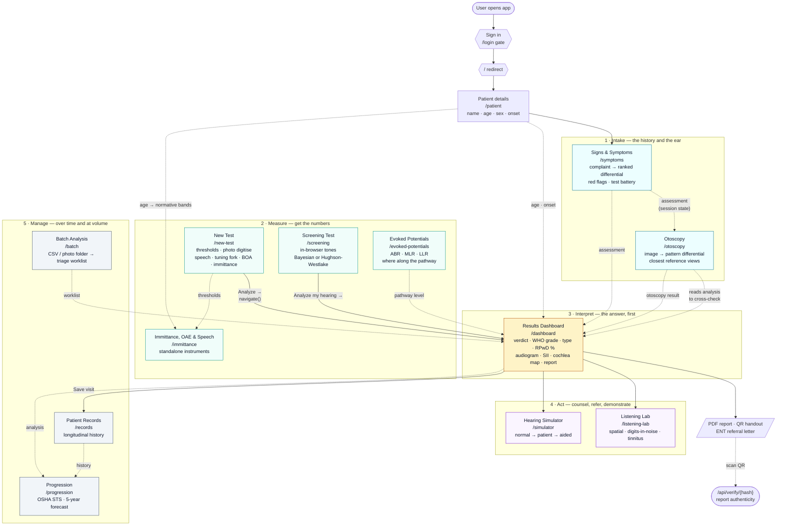
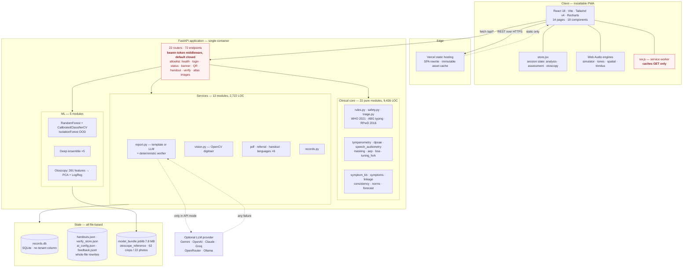
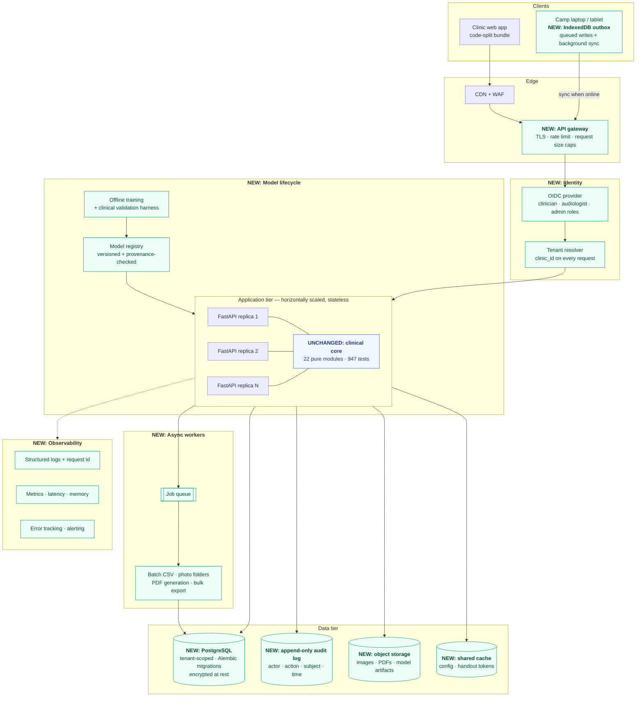
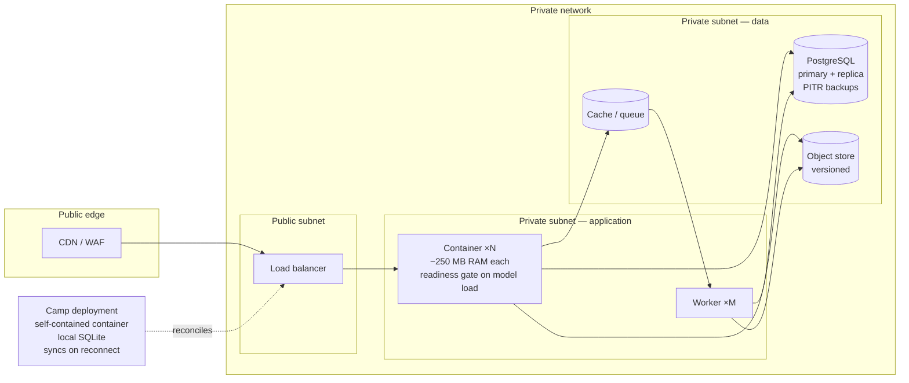
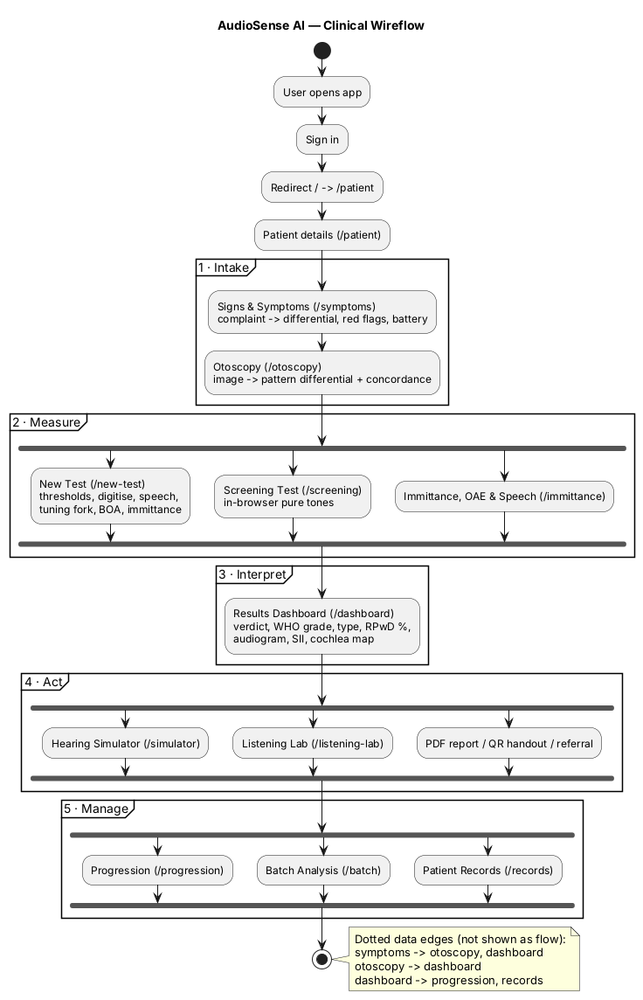
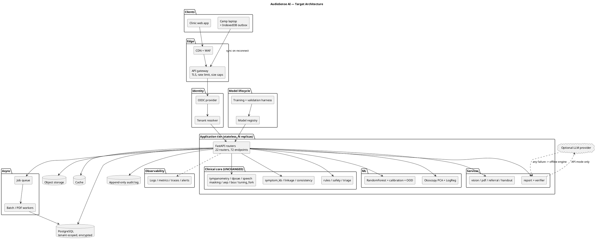

# AudioSense AI — Scaling Document

**Wireflow · Architecture · Tentative Budget**

| | |
|---|---|
| **Document** | Scaling plan, v1.0 |
| **Date** | 11 August 2026 |
| **Status of product** | Hackathon-winning prototype, feature-complete for demonstration, **not yet fit for clinical deployment** |
| **Repository** | `SUBASH-R-007/AudioSense-AI`, branch `feat/audiosense-platform` |
| **Prepared for** | Scaling review — engineering, clinical, regulatory and finance |

> **How to read this document.** Every figure in Sections 1–4 was measured from the
> repository on the date above, not estimated. Section 5 (budget) is explicitly
> *tentative* — each line carries its assumption and a confidence rating, and the
> items most likely to move are flagged. A scaling plan that hides the gaps is
> worse than no plan, so Section 4 states them plainly.

---

## Table of contents

1. [Where the product actually stands](#1-where-the-product-actually-stands)
2. [Wireflow](#2-wireflow)
3. [Architecture](#3-architecture)
4. [The gap register — what must change to scale](#4-the-gap-register--what-must-change-to-scale)
5. [Tentative budget](#5-tentative-budget)
6. [Risks and what would change the plan](#6-risks-and-what-would-change-the-plan)
7. [Appendix A — diagram source (Mermaid + PlantUML)](#appendix-a--diagram-source)
8. [Appendix B — measured inventory](#appendix-b--measured-inventory)

---

## 1. Where the product actually stands

### 1.1 What exists

AudioSense AI is a full-battery audiometry interpretation platform: **14 page
modules** (13 routed screens behind a sign-in gate), **72 HTTP endpoints** across
69 paths, **~18,100 lines** of backend Python across 76 modules, **~14,600 lines**
of frontend across 48 files, and **947 automated tests**, all passing.

The clinical core covers pure-tone audiometry with masking, speech audiometry
(SDT/SRT/WRS), immittance across eight tympanogram types, otoacoustic emissions,
otoscopy image classification, symptom triage, auditory evoked potentials
(ABR/MLR/LLR), behavioural observation audiometry, and tuning-fork testing — with
every modality cross-checked against the others.

### 1.2 The three honest caveats

These are not new discoveries; they are already stated inside the product's own UI
and documentation. They are repeated here because they set the scaling agenda.

| Caveat | Detail | Consequence for scaling |
|---|---|---|
| **The ML is validated on synthetic data** | 99.9% hold-out accuracy is on 12,000 audiograms the system generated itself — it measures only that the model learned its own generator. Against expert labels the rules score κ=1.0 and the ML pattern classifier 83.3% (κ=0.795) on a small bundled set. | A prospective clinical validation study is the single largest non-engineering cost in this plan. |
| **The otoscopy atlas is smaller than it appears** | 62 labelled views, but they are crops extracted from **22 source photographs** (montage figures split by `extract_otoscope_reference.py`). Leave-one-out validation holds out one crop while its 3–5 siblings — same camera, same session, possibly the same ear — remain in the training fold. | The reported ~44% top-1 accuracy is **optimistic by an unknown margin**. A real annotated dataset is required before this feature can be relied on. |
| **Authentication has shipped; authorisation has not** | Environment-configured accounts, PBKDF2-HMAC-SHA256 at 600,000 rounds, HMAC-signed 12-hour session tokens, default-closed middleware over every route with a stated public allowlist, and a structural frontend gate. What does **not** exist is authorisation: no roles, no owner column, no clinic dimension, no audit actor — so every signed-in user can read, export and delete every patient. | Single-clinic deployment is viable with accounts configured. Multi-clinic is not: it needs the tenancy and audit work in gaps 1–2. |

### 1.3 Measured performance baseline

| Metric | Measured value | Method |
|---|---|---|
| Full interpretation latency | **449 ms** median, in-process | 5 warm `POST /api/analyze` calls, two-ear AC+BC record |
| End-to-end quoted figure | ~670 ms, 89 cases/minute | Repository benchmark, single machine |
| RAM after model load | **213 MB** | `joblib.load(model_bundle.joblib)` |
| RAM with all 22 routers imported | **248 MB** | working set |
| Model cold load | **2.85 s** cold, 1.63 s warm | lazy `lru_cache` — the first request after a container start pays it |
| Committed model artifacts | **~11 MB** | `model_bundle` 7.8 MB, `deep_ensemble` 822 KB, `otoscopy_model` 162 KB, atlas 1.3 MB |
| Realistic container image | **~900 MB – 1.1 GB** | 571 MB site-packages + `python:3.11-slim` + OpenCV system libs |
| Frontend bundle | **897 KB** single uncompressed JS chunk, 2 MB dist | no code splitting |
| Training peak memory | 400–500 MB | documented; artifacts are committed because hosts cannot train |

**Reading of the baseline:** the workload is CPU-bound and memory-modest. One
container comfortably serves a clinic. The costs in this plan are dominated by
*people, evidence and compliance* — not by compute.

---

## 2. Wireflow

### 2.1 Design intent

The application is ordered the way a consultation runs: **who the patient is →
history → look in the ear → measure → interpret → act**. An unauthenticated load
renders the sign-in screen; after sign-in the bare origin redirects to
`/patient`, the Patient details screen that opens the consultation.

Demographics come first, and that ordering is load-bearing rather than
cosmetic. The age selects the normative band a tympanogram is judged against,
decides whether behavioural audiometry is obtainable at all, and reorders the
whole battery under six months. While these fields lived in the middle of the
pure-tone form, the two screens before it could not see them — immittance
defaulted to a 30-year-old and judged a child's tympanogram against adult
norms. `frontend/src/lib/flow.js` now declares the seven-step order once, and
the sidebar, the step footer and the skip logic all read it.

The load-bearing idea is that findings **constrain each other**. The symptom
assessment, the otoscopy result and the audiometric analysis live in shared
session state precisely so that a finding recorded on one screen can be
contradicted by another. That is why the wireflow below has two edge types:
navigation edges the user clicks, and **data edges** where a result recorded on one
screen changes what a different screen displays.

### 2.2 Wireflow diagram

**Solid arrows** are navigation the user performs. **Dotted arrows** are data
crossing screens through shared session state — the cross-checking that
distinguishes this product from a calculator.

### 2.3 Screen inventory

| # | Route | Screen | Purpose | Key API calls |
|---|---|---|---|---|
| 1 | `/patient` | Patient details | Name, age, sex, onset — captured once, before anything is judged against a normative band | (none; writes shared state read by every later screen) |
| 2 | `/symptoms` | Signs & Symptoms | Complaint → ranked differential, red flags, recommended battery | `symptomCatalog`, `symptoms`, `linkage` |
| 3 | `/otoscopy` | Otoscopy | Tympanic-membrane image → pattern differential + concordance | `otoscopyAtlas`, `otoscopyModel`, `otoscopy`, `diseasesFromOtoscopy` |
| 4 | `/new-test` | New Test | Enter or digitise a full record; run the analysis | `demoCases`, `digitize`, `analyze`, `tuningFork`, `boa` |
| 5 | `/screening` | Screening Test | In-browser pure-tone screening into the same pipeline | `analyze` |
| 6 | `/immittance` | Immittance, OAE & Speech | Tympanometry, DP-gram and speech as instruments | `tympanometry`, `oae`, `speech` |
| 7 | `/evoked-potentials` | Evoked Potentials | ABR / MLR / LLR with pathway localisation | `abr`, `abrThreshold`, `mlr`, `llr`, `aepBattery` |
| 8 | `/dashboard` | Results Dashboard | The verdict, the evidence, the report | `report`, `prescription`, `pdf`, `handout`, `referral`, `saveVisit` |
| 9 | `/simulator` | Hearing Simulator | Hear the loss; hear the aid | `speech-words`, `prescription` |
| 10 | `/listening-lab` | Listening Lab | Spatial hearing, digits-in-noise, tinnitus | `localization`, `digitsInNoise`, `tinnitus` |
| 11 | `/progression` | Progression | OSHA STS, ASHA criteria, 5-year forecast | `progression` |
| 12 | `/batch` | Batch Analysis | CSV or photo folder → triage worklist | `batch`, `batchPhotos`, `validate` |
| 13 | `/records` | Patient Records | Longitudinal patient history | `patients`, `patientHistory` |

### 2.4 Personas the flows imply

| Persona | Entry point | Journey |
|---|---|---|
| **Audiologist in a booth** | `/symptoms` or `/new-test` | Full battery → dashboard → report → save visit |
| **Camp screener** | `/screening` | Screen → analyse → triage → referral letter for those flagged |
| **ENT / physician** | `/otoscopy` | Image-first differential, then order the battery it recommends |
| **Occupational health officer** | `/batch` | Bulk shift audiograms → worklist → progression tracking |
| **Patient / family** | QR handout | Counselling sheet in one of six languages on their own phone |

### 2.5 Wireflow gaps worth noting

- **3 of 69 `/api` paths have no client method, and none of them are dead.**
  `GET /api/verify/{h}` is opened by scanning a printed QR,
  `GET /api/qr` renders into a print sheet, and
  `GET /api/otoscopy/image/{label}/{filename}` is loaded as an `` `src` —
  all out-of-band rather than unreachable. The one genuine gap is
  `DELETE /api/records/patients/{id}`: it is behind the session token, but it has
  no client method and no UI, so the erasure path a deletion request goes through
  can only be exercised with `curl`.
- **"Offline mode" in the sidebar means the offline *AI engine*, not offline
  operation.** See §4.

---

## 3. Architecture

### 3.1 Current architecture (as built)

The central architectural decision — and the one worth preserving through
scaling — is that **the deterministic clinical core is strictly separated from the
machine learning**. Degree, type and disability are pure functions with
guideline-cited docstrings; they cannot drift and are validated by conformance.
The ML sits alongside, handles only pattern recognition, and is permitted to say
"I don't know."

**Dependency direction** is one-way: `routers → clinical/ml/services → data`. The
clinical package performs **no file, network, database or joblib I/O** — verified.
That purity is what makes 947 tests fast and what will make the core portable when
the surrounding infrastructure is replaced.

#### Current deployment

| Half | Where | How |
|---|---|---|
| Frontend | Vercel | Static Vite build, SPA rewrite, root directory `frontend` |
| Backend | Any container host | Single `backend/Dockerfile`, Hugging Face Spaces recommended |
| Joined by | Two environment variables | `VITE_API_BASE_URL` and `CORS_ORIGINS` |

### 3.2 Target architecture (what scaling requires)

Changes from the current design are marked. **The clinical core is deliberately
untouched** — it is the asset, and it already has the right shape.

### 3.3 Deployment topology

---

## 4. The gap register — what must change to scale

Thirteen gaps, every one traceable to something in the repository. Effort is in
**person-weeks (pw)** of engineering.

| # | Gap | Why it blocks scaling | Effort |
|---|---|---|---|
| 1 | **Authorisation & multi-tenancy — authentication has shipped, authorisation has not** | Every route is behind a session token, but every signed-in user is equal: no roles, no per-clinic ownership on `patients`/`visits`, no audit actor. One clinic's staff can read, export and delete another's records. `POST /api/settings/ai` now requires a token, but any signed-in user can still redirect patient data off-box via the `ollama` `base_url`. | **3–4 pw** |
| 2 | **Multi-tenancy — no clinic dimension** | `patients` and `visits` have no `clinic_id`. Isolation today means one container per clinic: N copies of a ~1 GB image and N unversioned SQLite files. | 3–5 pw |
| 3 | **Database beyond SQLite, with migrations** | New connection per call, `CREATE TABLE IF NOT EXISTS` only, no WAL, no version table — any future schema change is a silent no-op. | 3–4 pw |
| 4 | **PHI encryption & transport control** | Nothing encrypted at rest. `GET /api/handout/{h}` is an unauthenticated capability URL that never expires. DPDP Act 2023 treats this as sensitive personal data. | 3–5 pw |
| 5 | **Audit logging** | No record of who read or deleted anything. For occupational hearing conservation — where a threshold shift becomes a compensation claim — an audiogram without tamper-evident provenance has little evidential value. | 2–3 pw |
| 6 | **Backups & disaster recovery** | `DEPLOYMENT.md` documents data loss as expected: *"Patient records disappear after a redeploy — Expected."* No volume, no backup job, no export path. | 1–2 pw |
| 7 | **Observability** | No structured logging, metrics, tracing or error tracking. With ~250 MB resident in a possibly-512 MB container, the realistic failure is a silent OOM nobody can attribute. | 2–3 pw |
| 8 | **CI/CD** | **No `.github/` directory.** 947 tests exist and nothing runs them on push. The model artifact is committed, not built, so a stale model can ship indefinitely with no signal. | 1–2 pw |
| 9 | **Rate limiting & request-size caps** | Batch reads whole CSVs into memory; digitize reads whole images; PDF and report paths are CPU-heavy. One signed-in caller can exhaust a single-worker instance; the login route itself spends ~360 ms of PBKDF2 per attempt and is public by necessity. In API mode it is also a cost-amplification vector. | 1–2 pw |
| 10 | **Secret management** | Provider key stored as plaintext JSON; the saved file takes precedence over the environment forever after first write; `masked()` returns the last 4 characters to any signed-in caller. | 1–2 pw |
| 11 | **Horizontal scaling** | Three concrete blockers: a module-level config global written to local disk; whole-file JSON rewrites for handouts and verification hashes; a per-process 200 MB model cache with a 1.6–2.9 s cold load. | 3–4 pw |
| 12 | **Offline sync for camps** | `sw.js` returns early for any non-GET request. Every clinically useful action is a POST, so with the network gone the shell loads and **nothing can be analysed or saved** — directly at odds with the stated camp use case. | 4–6 pw |
| 13 | **CORS is demo-shaped — and authentication has now landed, so this is live** | `allow_credentials=True` with localhost origins allowed in production, and a recommended regex trusting every `*.vercel.app`. This was filed as harmless-until-auth-exists; auth exists, so it is now a credentialed cross-origin PHI read from any host matching the regex. Raise the priority: it should land before the next deployment. | 0.5 pw |
| | **Total** | | **≈ 29–45 pw** (7–11 person-months) |

> **Sequencing constraint.** Gaps 1, 2, 3 and 13 must land in the same release.
> Adding authentication without fixing CORS converts a harmless misconfiguration
> into a vulnerability, and audit logging (5) has no actor to record until
> authentication exists.

### 4.1 Evidence gaps (not engineering)

| Gap | Current state | What closing it requires |
|---|---|---|
| **Clinical validation of the ML** | Synthetic-data accuracy; small expert-labelled comparison | Prospective, multi-site study against a reference standard |
| **Otoscopy dataset** | 62 crops from 22 photographs | A few thousand independently sourced, expert-annotated images |
| **Regulatory status** | None | CDSCO SaMD pathway, ISO 13485 QMS, IEC 62304 lifecycle records |
| **Digitiser accuracy** | One ground-truth regression harness (`test_digitize.py`) against generated samples | Validation against real photographed charts from multiple clinics |

---

## 5. Tentative budget

### 5.1 Assumptions — read these first

| Assumption | Value |
|---|---|
| Currency | Indian Rupees (₹); USD at **₹85 = $1** |
| Location | Chennai / Bengaluru salary bands, 2026 |
| Horizon | **24 months**, three phases |
| Salary basis | Annual CTC, loaded ×1.2 for employer overhead |
| Regulatory route | CDSCO Software as a Medical Device, assumed **Class B** |
| Confidence | ●●● firm · ●●○ moderate · ●○○ wide band |

> **The dominant cost is people and evidence, not compute.** Cloud is under 3% of
> the 24-month total. Anyone benchmarking this plan against a typical SaaS build
> should expect that inversion — it is a regulated medical product.

### 5.2 Phase plan

| Phase | Months | Objective | Exit criterion |
|---|---|---|---|
| **P1 — Harden** | 0–6 | Close gaps 1–13; make the platform deployable to a real clinic | Two pilot clinics live; SOC-style security review passed |
| **P2 — Validate** | 6–18 | Prospective clinical validation; build the otoscopy dataset; QMS and regulatory file | Validation study read out; CDSCO application filed |
| **P3 — Scale** | 18–24 | Multi-site rollout, offline camp deployment, ABDM integration | 25+ sites; unit economics established |

### 5.3 Team cost

| Role | CTC (₹ LPA) | P1 | P2 | P3 | Loaded cost, 24 mo (₹ lakh) | Conf. |
|---|---:|:---:|:---:|:---:|---:|:---:|
| Tech lead / principal engineer | 24 | 1 | 1 | 1 | 57.6 | ●●● |
| Backend engineer | 14 | 2 | 2 | 2 | 67.2 | ●●● |
| Frontend engineer | 14 | 1 | 1 | 1 | 33.6 | ●●● |
| ML engineer | 18 | 0.5 | 1 | 1 | 37.8 | ●●● |
| DevOps / SRE | 18 | 0.5 | 1 | 1 | 37.8 | ●●● |
| QA / test engineer | 10 | 0.5 | 1 | 1 | 21.0 | ●●● |
| Clinical lead — audiologist (0.5 FTE) | 12 | 0.5 | 0.5 | 0.5 | 14.4 | ●●○ |
| Clinical research coordinator | 8 | — | 1 | 0.5 | 12.0 | ●●○ |
| Product / regulatory affairs | 16 | 0.5 | 1 | 1 | 33.6 | ●●○ |
| **Total — including 20% employer overhead** | | | | | **₹315.0 lakh** | |

**≈ ₹3.15 crore / $370,600 over 24 months.**

*Headcount columns are FTE within each phase. The cost column already carries the
20% employer loading, so it is not added again anywhere below — the un-loaded
salary sum is ₹262.5 lakh.*

### 5.4 Clinical validation and data

| Item | Detail | Cost (₹ lakh) | Conf. |
|---|---|---:|:---:|
| Prospective validation study | 1,500 audiograms, 3 sites, reference standard by 2 independent audiologists with adjudication | 35.0 | ●○○ |
| Ethics / IRB submissions | 3 sites × ₹0.6 L, plus protocol and statistician | 4.5 | ●●○ |
| Biostatistician | Protocol design, powering, analysis, report | 6.0 | ●●○ |
| **Otoscopy dataset** | 5,000 images from ≥5 sources; 2 expert annotators + adjudication at ~₹150/image effective | 12.0 | ●○○ |
| Digitiser validation set | 500 real photographed charts, ground-truthed | 3.0 | ●●○ |
| Site coordination and consumables | Travel, incentives, consent administration | 5.0 | ●●○ |
| | | **₹65.5 lakh** | |

**≈ ₹65.5 lakh / $77,000.** *This is the line most likely to move.* A regulator
requiring a larger N, or a Class C classification requiring a clinical
investigation rather than a retrospective/prospective accuracy study, could double
it.

### 5.5 Regulatory and compliance

| Item | Detail | Cost (₹ lakh) | Conf. |
|---|---|---:|:---:|
| ISO 13485 QMS — implementation | Consultant-led, 9–12 months | 8.0 | ●●○ |
| ISO 13485 certification audit | Notified body, stage 1 + stage 2 | 5.0 | ●●○ |
| IEC 62304 software lifecycle records | Retro-documentation of the existing 68 modules + process going forward | 6.0 | ●●○ |
| CDSCO regulatory consultant | Retainer, 18 months | 15.0 | ●●○ |
| CDSCO application fees | MD-5 (Class B, State Licensing Authority) + test licence | 1.0 | ●●● |
| DPDP Act 2023 readiness | Consent architecture, DPO advisory, privacy notices | 6.0 | ●●○ |
| Independent security audit + VAPT | Pre-pilot and pre-scale, 2 rounds | 7.0 | ●●● |
| Cyber liability + professional indemnity | 24-month premium | 6.0 | ●●○ |
| ABDM / ABHA integration | Sandbox onboarding and certification (P3) | 5.0 | ●○○ |
| | | **₹59.0 lakh** | |

**≈ ₹59 lakh / $69,000.**

> **Regulatory classification is the single largest uncertainty in this document.**
> The plan assumes Class B. If CDSCO treats disability-percentage output under the
> RPwD Act as a Class C determination, add roughly **₹40–60 lakh** and **9–12
> months** for the MD-9 central pathway.

### 5.6 Infrastructure and tooling

| Item | Basis | ₹/month | 24-mo (₹ lakh) | Conf. |
|---|---|---:|---:|:---:|
| Application containers | 3–6 × 1 vCPU / 1 GB (250 MB resident + headroom) | 18,000 | 4.32 | ●●● |
| Managed PostgreSQL | HA primary + replica, PITR | 15,000 | 3.60 | ●●● |
| Object storage + CDN | Images, PDFs, artifacts, static | 6,000 | 1.44 | ●●● |
| Cache / queue | Managed Redis | 5,000 | 1.20 | ●●● |
| Observability | Logs, metrics, error tracking | 8,000 | 1.92 | ●●● |
| Backups and DR | Snapshots, cross-region copy | 4,000 | 0.96 | ●●● |
| Staging environment | ~40% of production | 20,000 | 4.80 | ●●● |
| CI minutes, registry, secrets | | 5,000 | 1.20 | ●●● |
| Dev tooling and licences | IDEs, design, project tracking | 12,000 | 2.88 | ●●● |
| **LLM API (optional path)** | Report narration only; offline engine is the default and the fallback | 10,000 | 2.40 | ●●○ |
| | | **₹1.03 L** | **₹24.72 lakh** | |

**≈ ₹24.7 lakh / $29,000.** Deliberately modest: the workload is CPU-bound and
memory-light, and the product works with **zero API keys**.

### 5.7 Pilot hardware (optional — only if deploying the camp model)

| Item | Unit ₹ | Qty | ₹ lakh | Conf. |
|---|---:|---:|---:|:---:|
| Screening audiometer, calibrated | 85,000 | 5 | 4.25 | ●●○ |
| Tympanometer | 2,20,000 | 3 | 6.60 | ●●○ |
| USB otoscope camera | 18,000 | 8 | 1.44 | ●●● |
| Calibrated headphones (TDH / insert) | 12,000 | 10 | 1.20 | ●●● |
| Camp laptops / tablets | 55,000 | 8 | 4.40 | ●●● |
| Annual calibration contracts | 25,000 | 8 | 2.00 | ●●○ |
| | | | **₹19.89 lakh** | |

**≈ ₹19.9 lakh / $23,000.** Excluded from the headline total — it belongs to a
deployment decision, not to the platform.

### 5.8 Budget summary

| Category | ₹ lakh | USD | Share |
|---|---:|---:|---:|
| Team (24 mo, loaded) | 315.0 | $370,600 | **67.9%** |
| Clinical validation & data | 65.5 | $77,100 | 14.1% |
| Regulatory & compliance | 59.0 | $69,400 | 12.7% |
| Infrastructure & tooling | 24.7 | $29,100 | 5.3% |
| **Platform total (24 months)** | **₹464.2 lakh** | **≈ $546,100** | 100% |
| *Optional pilot hardware* | *19.9* | *$23,400* | *—* |
| **With hardware** | **₹484.1 lakh** | **≈ $569,500** | |

**Recommended contingency: 20% (₹92.8 lakh), giving a planning figure of
≈ ₹557 lakh / $655,400.** The 20% is not padding — §5.4 and §5.5 each rest on a
single assumption (study size; risk classification) capable of moving the total by
more than that on its own.

### 5.9 Phasing of spend

| Phase | Months | Team | Clinical | Regulatory | Infra | **Total (₹ lakh)** |
|---|---|---:|---:|---:|---:|---:|
| **P1 — Harden** | 0–6 | 61.8 | 4.0 | 10.5 | 5.0 | **81.3** |
| **P2 — Validate** | 6–18 | 170.4 | 55.0 | 34.0 | 12.4 | **271.8** |
| **P3 — Scale** | 18–24 | 82.8 | 6.5 | 14.5 | 7.3 | **111.1** |
| **Total** | | **315.0** | **65.5** | **59.0** | **24.7** | **464.2** |

Principal drivers: P1 team ramp, security audit round 1, infrastructure
build-out, otoscopy dataset kick-off. P2 full team, validation study, QMS and
CDSCO file. P3 rollout, ABDM integration, security audit round 2.

### 5.10 What ₹464 lakh does *not* buy

Stated so the number is not mistaken for a complete business plan:

- Sales, marketing and distribution
- Customer support and clinical helpdesk beyond the pilot
- Office space and administration
- Founder or equity compensation
- Any international regulatory route — CE/UKCA or FDA 510(k) would each add a
  comparable regulatory line
- Hearing-aid fitting hardware or dispensing operations

---

## 6. Risks and what would change the plan

| # | Risk | Likelihood | Impact | Mitigation |
|---|---|---|---|---|
| 1 | **CDSCO classifies as Class C**, not B | Medium | +₹40–60 L, +9–12 months | Seek a pre-submission classification opinion in month 1 — cheapest possible de-risking |
| 2 | **Clinical validation underperforms** the synthetic-data figures | **Medium–High** | Feature descope; retraining; timeline slip | Run a 200-case pilot read-out at month 9 as a go/no-go before committing the full study |
| 3 | **Otoscopy accuracy stays below clinical utility** even with 5,000 images | Medium | Feature repositioned as retrieval-only | The product already ships this honestly — reference retrieval is the durable value, and the UI already states measured accuracy |
| 4 | **A PHI incident** | Reduced — authentication has shipped | Existential | Residual exposure is what remains: every signed-in user sees every patient, no audit trail, no encryption at rest, and handout/verify URLs are deliberately public capability links. Single-clinic use with accounts configured is defensible; multi-clinic is gated on gaps 1–2 |
| 5 | Key-person dependency — one author, 20 commits | High | Delivery risk | Pair up the clinical core early; the 947 tests and cited docstrings are already strong knowledge transfer |
| 6 | Offline camp model proves harder than estimated | Medium | +2–4 pw | Prefer the local-backend-on-laptop route over browser sync if reconciliation proves complex |
| 7 | LLM provider cost or policy change | Low | Low | Offline engine is already the default with automatic fallback — no dependency to break |

### 6.1 Recommended immediate actions (first 60 days)

1. **Single-clinic deployment is acceptable** once `AUDIOSENSE_USERS` and `AUDIOSENSE_SECRET` are set. **Multi-clinic remains frozen** until authorisation and audit (gaps 1–2) land — today one clinic's staff can read and delete another's records.
2. **Add CI** — 947 tests exist and nothing runs them; this is 1–2 pw for
   disproportionate return.
3. **Obtain a CDSCO classification opinion.** It is the cheapest way to remove the
   largest budget uncertainty.
4. **Start the otoscopy dataset now.** It is the longest lead-time item and gates
   the most-caveated feature.
5. **Correct the README claim** that the model comparison is available in the app.

---

## Appendix A — diagram source

Diagrams above are Mermaid and render natively on GitHub. PlantUML equivalents
follow for tools that require UML.

### A.1 Wireflow — PlantUML activity diagram

### A.2 Architecture — PlantUML component diagram

---

## Appendix B — measured inventory

All figures re-measured from the repository on 15 August 2026, after the access-control and consultation-flow work landed. Where this appendix and the prose disagree, the appendix is the later count.

### B.1 Codebase

| Layer | Files | LOC |
|---|---:|---:|
| `app/clinical/` | 23 | 10,030 |
| `app/services/` | 14 | 3,151 |
| `app/routers/` | 22 | 2,454 |
| `app/otoscopy/` | 3 (+`__init__`) | 1,612 |
| `app/ml/` | 5 | 757 |
| `app/models/schemas.py` | 1 | 135 |
| `app/main.py` | 1 | 134 |
| **Backend total** | **70** | **≈ 18,300** |
| `frontend/src/pages/` | 14 | 7,179 |
| `frontend/src/components/` | 18 | 4,840 |
| `frontend/src/lib/` | 6 | 1,179 |
| `frontend/src/audio/` | 7 | 1,423 |
| **Frontend total** | **48** | **≈ 14,800** |
| **Tests** | **30 files** | **947 tests, all passing** |

### B.2 Interfaces

| Surface | Count |
|---|---:|
| Registered FastAPI routes | 77 |
| — application endpoints under `/api` | 72 (across 69 unique paths) |
| — non-`/api` (`/`, `/docs`, `/docs/oauth2-redirect`, `/redoc`, `/openapi.json`) | 5 |
| — `/api` paths reached by a client method | 66 of 69 |
| — `/api` paths with no client method | 3, all out-of-band (QR scan, print sheet, `` atlas) |
| Sidebar navigation entries | 13 (7 flow steps + 6 tools, from `flow.js`) |

### B.3 Data and model artifacts

| Artifact | Size |
|---|---:|
| `model_bundle.joblib` | 7.81 MB |
| `deep_ensemble.joblib` | 822 KB |
| `otoscopy_model.joblib` | 162 KB |
| `dataset.csv` (12,000 synthetic audiograms) | 828 KB |
| `otoscope_reference/` | 1.3 MB — **62 crops from 22 source photographs** |
| Frontend `dist` | 2 MB, single 897 KB JS chunk |
| Runtime state (gitignored) | `handouts.json` 706 KB, `records.db` 37 KB, `verify_store.json` 17 KB |

### B.4 Clinical standards implemented

WHO World Report on Hearing 2021 · India RPwD Act 2016 / 2018 Gazette · ASHA and
BSA procedures · OSHA 29 CFR 1910.95 · NIOSH 1998 · ISO 7029 · ISO 389-1 ·
ANSI S3.5-1997 (SII) · Jerger tympanogram types extended to eight per Gelfand
*Essentials of Audiology* 4th ed. · Thornton & Raffin 1978 · Clopper–Pearson exact
intervals · Byrne & Dillon 1986 (NAL-R) · Northern & Downs (BOA) · Chaiklin 1959 ·
Margolis & Heller 1987 · Dean & Martin 2000.

---

*Prepared from a full static analysis of the repository. Every measured figure is
reproducible from the commands in Appendix B. Budget figures are tentative
estimates with stated assumptions and confidence ratings, not quotations.*
